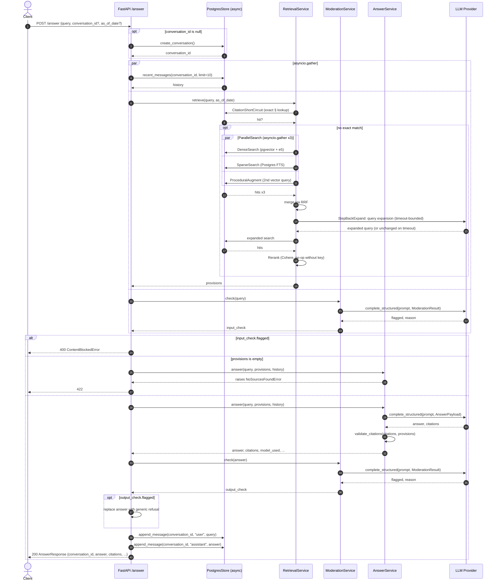

# `/answer` Request Sequence

Sequence diagram for `POST /answer` (`src/lawboi/api/routes/answer.py`), showing the
`asyncio.gather` concurrency points: history lookup + retrieval + input moderation run
together, and — inside retrieval — `DenseSearch`/`SparseSearch`/`ProceduralAugment` run
together too (`ParallelSearch`, merged via RRF). Output moderation is necessarily
sequential since it needs the generated answer.

